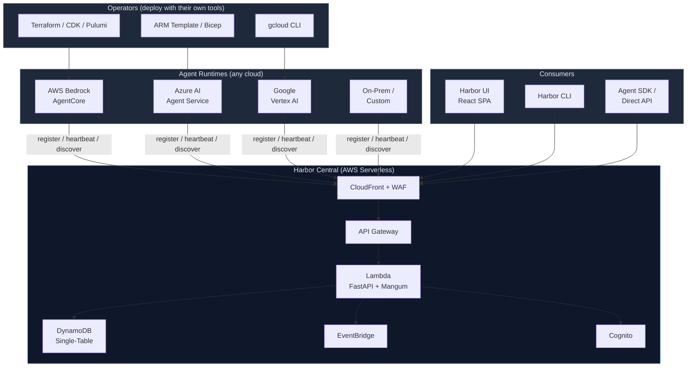
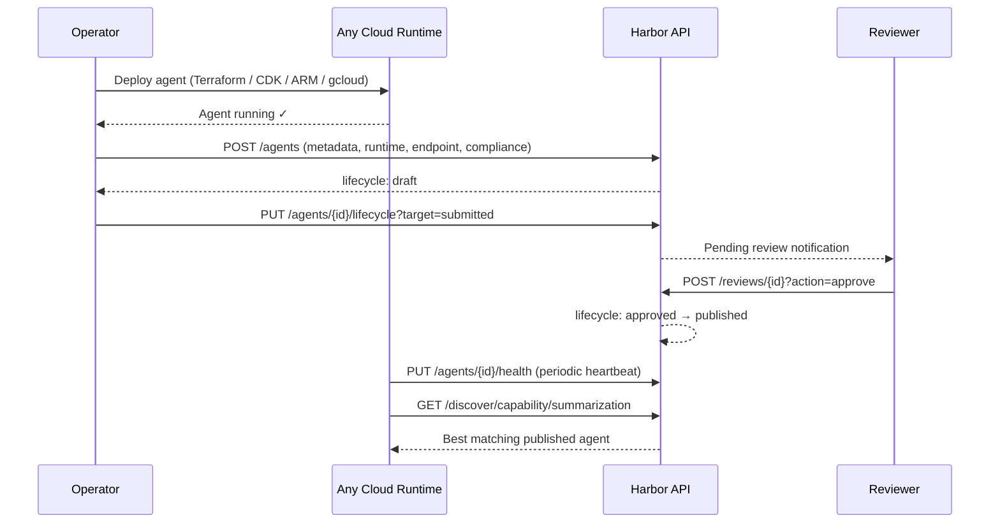
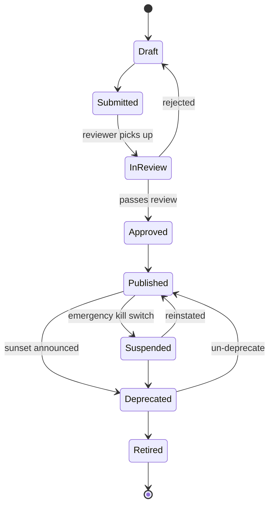
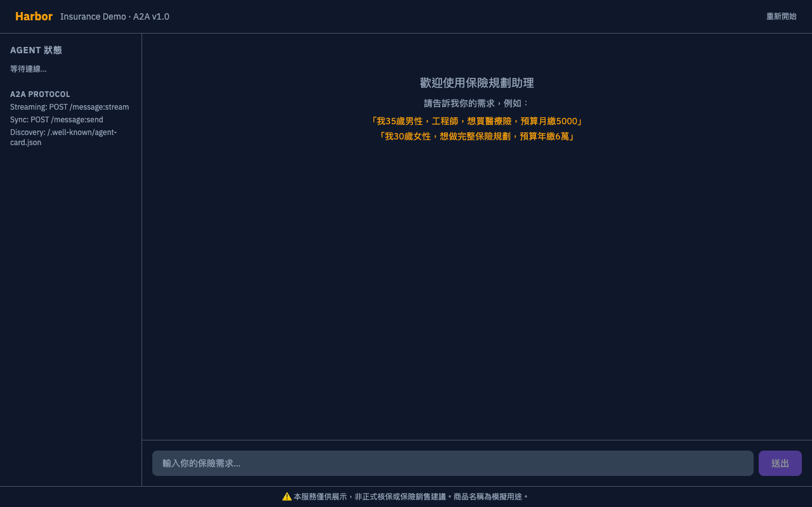

# ⚓ Harbor

**The Multi-Cloud Registry & Discovery Platform for AI Agents**

Harbor is a centralized registry, discovery, and governance platform for AI agents — regardless of where they run. Agents deployed on AWS Bedrock AgentCore, Azure AI Agent Service, Google Vertex AI, or your own infrastructure all register with Harbor to be discovered, governed, and audited.

> Harbor is a passport office, not an airline. Your agents fly on whatever cloud they want. Harbor issues the passport, checks compliance, and tells other agents where to find them.

---

## The Problem

Every cloud provider offers an agent runtime. None of them answer:

- **Which agents exist across our organization?** No central registry across clouds, accounts, and teams.
- **Who approved this agent for production?** No lifecycle governance or approval workflow.
- **Can Agent A talk to Agent B?** No cross-cloud communication policy enforcement.
- **What tools is this agent allowed to use?** No capability boundary control.
- **What happened at 3am?** No unified audit trail across your agent fleet.

These are the same problems API Management solved for microservices a decade ago. Harbor solves them for AI agents.

## Why Harbor

| Capability | Without Harbor | With Harbor |
|-----------|---------------|-------------|
| Agent inventory | Spreadsheets, tribal knowledge | Centralized registry with cross-cloud metadata |
| Deployment approval | Slack messages, hope | Lifecycle pipeline: draft → review → approve → publish |
| Cross-team discovery | "Hey, does anyone have an agent that does X?" | `harbor discover -c summarization` |
| Access control | All agents can call anything | Communication ACL + capability boundaries |
| Incident response | "Which agent is causing this?" | `harbor lifecycle agent-x suspended --reason "incident-1234"` |
| Compliance audit | Manual evidence collection | Immutable audit trail with tenant context |
| Multi-cloud governance | Per-cloud silos | Unified registry, one API for all providers |

## Key Differentiators

- **Cloud-agnostic registry** — agents from AWS, Azure, GCP, or on-prem all register with the same API and data model
- **Harbor is a registry, not a deployment tool** — operators deploy agents with their own tooling (Terraform, CDK, ARM Template, gcloud), then register metadata with Harbor
- **A2A Agent Card alignment** — agent metadata follows the A2A protocol spec, extended with governance and cross-cloud fields
- **Hot-swappable agent lifecycle** — register, publish, suspend, and retire agents without downtime; discovery always returns the latest published state
- **Enterprise governance** — lifecycle approval pipeline with role-based access (risk officer, compliance officer sign-off for production)
- **Multi-tenant by design** — tenant = cloud account/project/subscription; integrates with AWS Control Tower for org-wide visibility
- **Policy enforcement** — capability boundaries, communication ACL, and schedule windows — evaluated centrally, enforced across clouds
- **Full observability** — health monitoring, audit trail, EventBridge events, Security Hub integration

## Architecture



### Agent Onboarding Flow



## Agent Data Model

When registering, operators provide an "agent passport" — metadata about where the agent runs, how to reach it, and what it can do:

| Section | Fields | Who Provides |
|---------|--------|-------------|
| **Identity** | `agent_id`, `name`, `description`, `version` | Operator (required) |
| **Tenant** | `tenant_id`, `owner` | Operator (required) |
| **Runtime Origin** | `provider` (aws/azure/gcp/on-prem), `runtime`, `region`, `account_id`, `resource_id` | Operator |
| **Endpoint** | `url`, `protocol` (http/grpc/a2a/mcp), `auth_type`, `health_check_path` | Operator |
| **Capabilities** | `skills`, `capabilities`, `phase_affinity` | Operator |
| **Dependencies** | `required_agents`, `required_tools`, `models` | Operator |
| **Compliance** | `data_residency`, `certifications`, `pii_handling`, `data_classification` | Operator |
| **Governance** | `lifecycle_status`, `visibility`, `routing_rules` | Harbor-managed |

All fields except identity and tenant are optional with sensible defaults — low barrier to register, rich metadata for governance review.

## Agent Lifecycle



| Environment | Approval Required |
|------------|-------------------|
| dev | Auto-approve (self-publish) |
| staging | 1 approval from project admin |
| prod | 2 approvals: risk officer + compliance officer |

Only **published** agents are discoverable. **Suspended** is an emergency kill switch any admin can trigger.

## Quick Start

```bash
# Clone and setup
git clone https://github.com/yikaikao/harbor.git
cd harbor
python -m venv .venv && source .venv/bin/activate
pip install -e ".[dev,cli]"

# Run locally
uvicorn harbor.main:app --reload --port 8100

# Use the CLI
export HARBOR_URL=http://localhost:8100/api/v1
export HARBOR_TENANT=dev-tenant
export HARBOR_OWNER=dev@harbor.local

# Register an agent from any cloud
harbor register my-agent "My Agent" --capabilities nlp,summarize
harbor list
harbor lifecycle my-agent submitted
harbor discover -c nlp --resolve
harbor health my-agent
```

See [docs/getting-started.md](docs/getting-started.md) for the full setup guide.

## Runtime Policies

### Capability Boundaries

Control what each agent can access:

```yaml
tools:
  allowed: ["db_query", "send_email"]
  denied: ["execute_trade"]
  require_human: ["large_transfer"]
mcp_servers:
  allowed: ["internal-kb", "market-data"]
  denied: ["external-*"]
data_classification:
  max_level: "confidential"
```

### Communication ACL

Control which agents can talk to each other (default: allowlist / deny-all):

```yaml
rules:
  - from: "trading-agent"
    to: "risk-assessment-agent"
    required: true
  - from: "external-*"
    to: "internal-*"
    allowed: false
```

### Schedule Windows

Control when agents can operate:

```yaml
active_windows:
  - cron: "0 9-16 * * MON-FRI"
    timezone: "Asia/Taipei"
out_of_window_action: "reject"
```

## Tech Stack

| Layer | Technology |
|-------|-----------|
| Frontend | React + Tailwind CSS + Vite |
| API | FastAPI + Mangum (Lambda adapter) |
| Compute | AWS Lambda (Python 3.12, ARM64) |
| Gateway | API Gateway HTTP API + Cognito JWT |
| Storage | DynamoDB (single-table, multi-tenant) |
| CDN | CloudFront + S3 + WAF |
| Auth | Cognito + IAM Identity Center |
| Events | EventBridge + SNS |
| IaC | AWS CDK (TypeScript) |
| CLI | Click + httpx |

## Project Structure

```
harbor/
├── src/harbor/              # Python backend (FastAPI)
│   ├── models/              # Pydantic data models (agent, policy)
│   ├── store/               # DynamoDB persistence (5 store classes)
│   │   ├── base.py          # Shared table access
│   │   ├── agent_store.py   # Agent CRUD + indexes
│   │   ├── health_store.py  # Health status
│   │   ├── audit_store.py   # Audit entries
│   │   ├── policy_store.py  # Policy CRUD
│   │   └── version_store.py # Version snapshots
│   ├── registry/            # Agent lifecycle governance
│   ├── discovery/           # Capability & phase-based lookup
│   ├── policy/              # Runtime policy enforcement
│   ├── health/              # Health monitoring & heartbeat
│   ├── audit/               # Audit log service
│   ├── auth/                # JWT validation & RBAC
│   ├── events/              # EventBridge emitter
│   ├── sync/                # A2A Agent Card import
│   ├── cli/                 # CLI tool
│   └── api/                 # FastAPI routers (6 router modules)
│       ├── deps.py          # Service container & auth
│       ├── agents.py        # Agent CRUD + lifecycle
│       ├── discovery.py     # Discovery endpoints
│       ├── health.py        # Heartbeat + summary
│       ├── audit.py         # Audit log
│       ├── policies.py      # Policy CRUD + evaluate
│       └── reviews.py       # Review queue
├── frontend/                # React SPA
├── infrastructure/          # AWS CDK
├── tests/                   # 75 Python + 18 CDK tests
└── docs/                    # Architecture, API reference, guides
```

## Demo: Life Insurance Agent Platform

A complete sample application demonstrating Harbor + A2A + Strands Agents + Bedrock AgentCore integration. Six AI agents collaborate via A2A v1.0 protocol, managed by Harbor's lifecycle governance.

→ See full details in [samples/life-insurance/README.md](samples/life-insurance/README.md)

### Agent Registry & Discovery

```
$ harbor list
  explanation-agent              published    保險知識 Agent
  recommendation-agent           published    推薦引擎 Agent
  compliance-check-agent         published    合規檢查 Agent
  premium-calculator-agent       published    保費試算 Agent
  underwriting-risk-agent        published    風險預評估 Agent
  product-catalog-agent          published    商品目錄 Agent

$ harbor discover -c risk_assessment
  underwriting-risk-agent        風險預評估 Agent
```

### Lifecycle Governance — Emergency Kill Switch

```
$ harbor lifecycle underwriting-risk-agent suspended --reason 'incident-1234'
✓ underwriting-risk-agent → suspended

$ harbor discover -c risk_assessment
(empty — suspended agent is no longer discoverable!)
```

### A2A Agent Collaboration on AgentCore Runtime

The Orchestrator agent coordinates multiple specialist agents (product search, premium calculation, risk assessment) to produce a complete insurance plan:

```
>>> Invoking Orchestrator Agent via A2A protocol on AgentCore Runtime...
>>> Prompt: 我30歲，月預算3000元，想買醫療險，請幫我搜尋商品並試算保費

<<< Agent Response (26.0s):

## 搜尋結果與保費試算

### 方案一：國泰真全意住院醫療險 ⭐推薦
- 月保費：833元（住院日額 2,000元 / 手術限額 20萬元）

### 方案二：富邦人生自由行醫療險
- 月保費：977元（住院日額 2,500元 / 手術限額 25萬元）

### 風險評估結果
核保風險等級：「優體」，兩款商品都有15%的折扣。
```

### Frontend — Agent Status Dashboard



## Documentation

- [Architecture](docs/architecture.md) — system design, data model, lifecycle, policies
- [Getting Started](docs/getting-started.md) — local dev setup, API & CLI usage
- [API Reference](docs/api-reference.md) — all 29 endpoints with examples
- [Enterprise Integration Guide](docs/enterprise-integration-guide.md) — Control Tower deployment runbook
- [IAM Identity Center Setup](docs/iam-identity-center-setup.md) — SSO configuration

## API Overview

29 REST endpoints under `/api/v1`:

| Category | Endpoints |
|----------|-----------|
| Agent CRUD | POST/GET/PATCH/DELETE `/agents` |
| Lifecycle | PUT `/agents/{id}/lifecycle` |
| Versions | POST/GET `/agents/{id}/versions` |
| Health | PUT `/agents/{id}/health`, GET `/health/summary` |
| Audit | GET `/agents/{id}/audit`, GET `/audit` |
| Discovery | GET `/discover/capability/{cap}`, `/discover/phase/{phase}`, `/discover/resolve` |
| Policies | CRUD for capability, communication, schedule policies |
| Reviews | GET `/reviews/pending`, POST `/reviews/{id}` |

See [docs/api-reference.md](docs/api-reference.md) for full request/response examples.

## License

MIT
