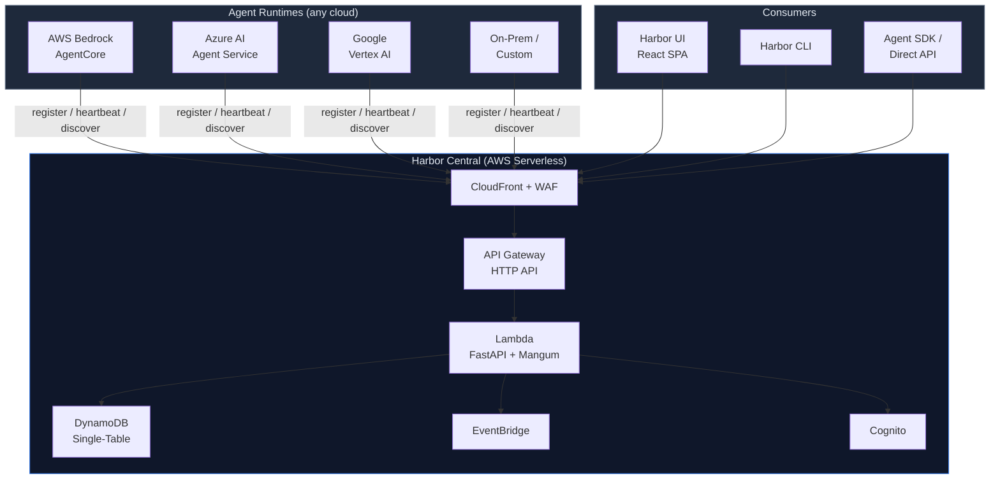
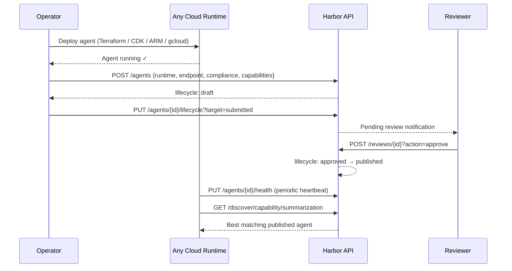
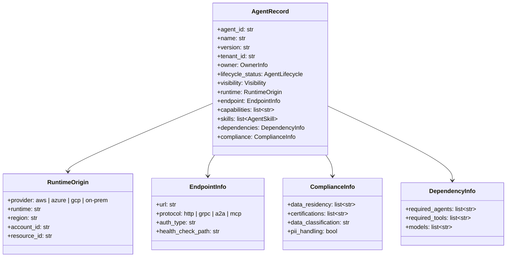
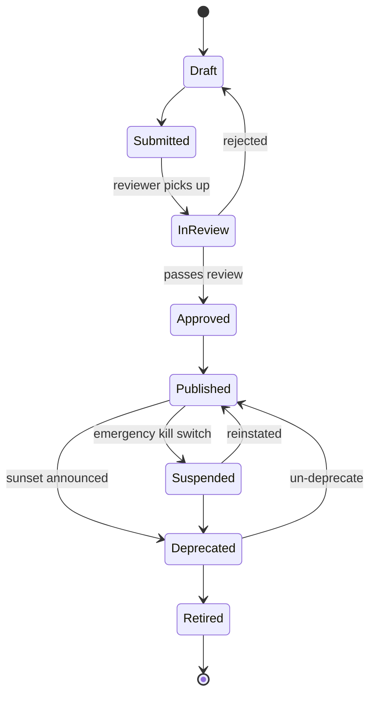
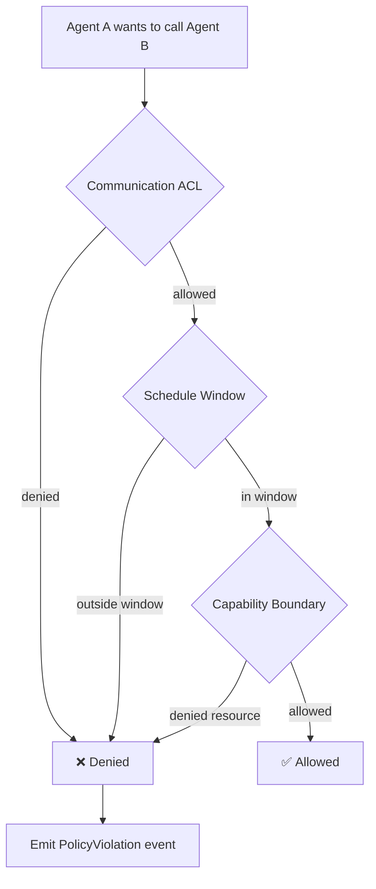
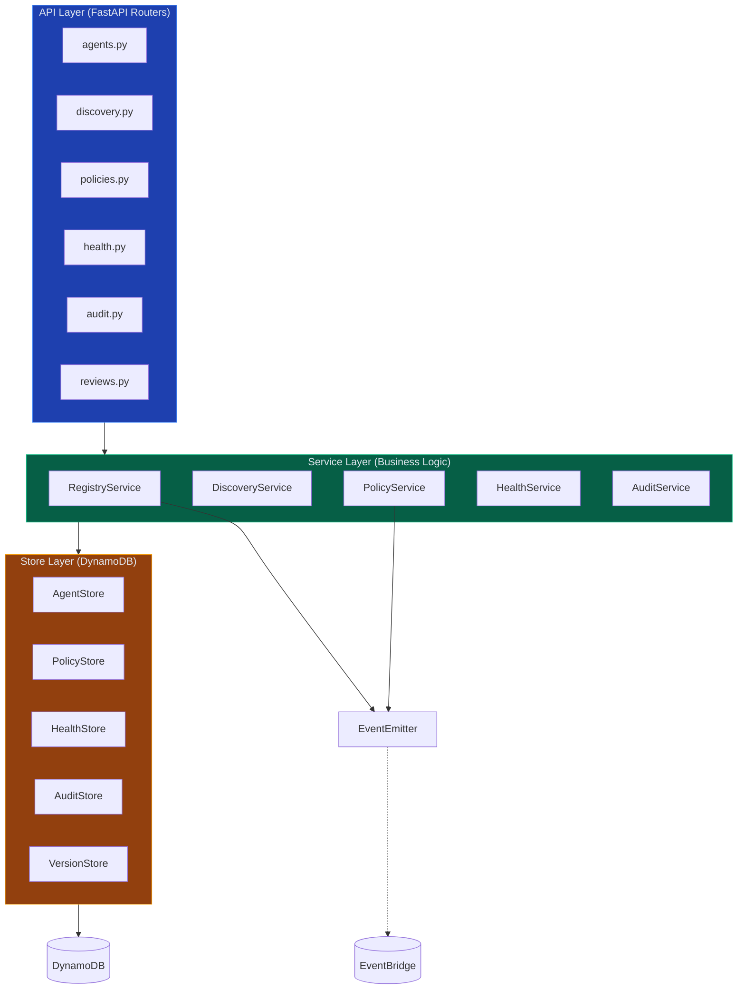

# Harbor — Architecture

## Overview

Harbor is a cloud-agnostic registry, discovery, and governance platform for AI agents. Operators deploy agents on any cloud (AWS, Azure, GCP) or on-prem using their own tooling, then register metadata with Harbor. Harbor provides centralized lifecycle governance, capability-based discovery, runtime policy enforcement, and an immutable audit trail.

Harbor is a **registry, not a deployment tool**. It doesn't run your agents — it knows where they are, what they can do, and whether they're allowed to do it.

## Design Principles

1. **Cloud-agnostic registry** — agents from any provider register with the same API and data model. The `RuntimeOrigin` field captures where the agent runs; Harbor doesn't care.
2. **Serverless-first** — Lambda + API Gateway for compute. Management-plane traffic is low and bursty; serverless is cost-optimal.
3. **Single-table DynamoDB** — all entities in one table with composite PK/SK keys. Multi-tenant by construction.
4. **Tenant = cloud account** — AWS Account ID, Azure Subscription ID, GCP Project ID, or org-assigned identifier. Derived from auth token, never passed as a parameter.
5. **Policy enforcement at the platform layer** — agents don't enforce their own governance. Harbor evaluates capability boundaries, communication ACLs, and schedule windows centrally.
6. **A2A Agent Card alignment** — agent metadata follows the A2A protocol spec, extended with governance and cross-cloud fields.
7. **Three-layer separation** — API → Service → Store → DynamoDB. No shortcuts.

## System Architecture



### Component Breakdown

| Component | Role |
|-----------|------|
| **CloudFront** | CDN for React SPA and API reverse proxy. HTTPS-only, TLS 1.2+. |
| **WAF** | AWS Managed CommonRuleSet + rate limiting (1000 req/5 min/IP). |
| **S3** | Static hosting for the React SPA. No public access — OAC only. |
| **API Gateway (HTTP API)** | Routes `/api/*` to Lambda. Throttled at 100 req/s burst, 50 sustained. |
| **Lambda** | Python 3.12 on ARM64 (Graviton). FastAPI app wrapped by Mangum. 256 MB, 30s timeout. |
| **DynamoDB** | Single-table, PAY_PER_REQUEST, point-in-time recovery enabled. |
| **Cognito** | User pool with JWT issuance. Federated with IAM Identity Center for SSO. |
| **EventBridge** | `harbor-events` bus for lifecycle events, policy violations, cross-account routing. |

## Agent Onboarding Flow

Operators deploy agents with their own tools, then register metadata with Harbor:



## Agent Data Model

The "agent passport" — metadata an operator submits to Harbor:



### Registration Requirements

| Field | Required | Notes |
|-------|----------|-------|
| `agent_id`, `name` | Yes | Identity |
| `tenant_id`, `owner` | Yes | Multi-tenant scoping |
| `runtime` | No | Defaults to `provider: aws`. Fill for cross-cloud visibility. |
| `endpoint` | No | Required for discovery to be useful. |
| `compliance` | No | Reviewers check this for prod approval. |
| `dependencies` | No | Used for dependency graph and impact analysis. |
| `capabilities` | No | Required for capability-based discovery. |

Low barrier to register, rich metadata for governance review.

## Data Model

### DynamoDB Single-Table Design

Table: `harbor-agent-registry`

| PK | SK | Entity |
|----|-----|--------|
| `TENANT#{tid}#AGENT#{aid}` | `META` | Agent record |
| `TENANT#{tid}#AGENT#{aid}` | `VER#{version}` | Version snapshot |
| `TENANT#{tid}#AGENT#{aid}` | `HEALTH` | Health status |
| `TENANT#{tid}#AGENT#{aid}` | `AUDIT#{timestamp}` | Audit entry |
| `TENANT#{tid}#CAP#{cap}` | `AGENT#{aid}` | Capability index |
| `TENANT#{tid}#PHASE#{phase}` | `AGENT#{aid}` | Phase index |
| `TENANT#{tid}#POLICY` | `AGENT#{aid}` | Capability policy |
| `COMM_RULE#{rule_id}` | `META` | Communication rule |
| `SCHEDULE#{aid}` | `META` | Schedule policy |

### Global Secondary Indexes

| GSI | PK | SK | Purpose |
|-----|----|----|---------|
| `status-index` | `status` | `updated_at` | Query by operational status |
| `tenant-index` | `tenant_id` | `updated_at` | List all entities for a tenant |
| `lifecycle-index` | `lifecycle_status` | `updated_at` | Query by lifecycle phase |

## Multi-Tenant Model

### Tenant Identity (Cloud-Agnostic)

| Cloud | tenant_id | Example |
|-------|-----------|---------|
| AWS | Account ID | `123456789012` |
| Azure | Subscription ID | `a1b2c3d4-...` |
| GCP | Project ID | `my-project-123` |
| On-prem | Org-assigned | `corp-team-alpha` |

All DynamoDB queries include `tenant_id` in the key condition — no cross-tenant data leaks by construction.

### Visibility Scopes

| Scope | Who Can See | Use Case |
|-------|-------------|----------|
| `private` | Same tenant only | Dev/draft agents |
| `ou_shared` | Same business unit | Shared within a department |
| `org_wide` | Entire organization | Compliance agents, shared utilities |

## Agent Lifecycle



| State | Description |
|-------|-------------|
| `draft` | Registered but not visible. Owner can edit freely. |
| `submitted` | Owner requests promotion. Awaiting review. |
| `in_review` | Reviewer has picked up the submission. |
| `approved` | All required approvals received. Ready to publish. |
| `published` | Live and discoverable. Only state visible in discovery. |
| `suspended` | Emergency kill switch. Immediately undiscoverable. |
| `deprecated` | Sunset announced. Dependents notified via EventBridge. |
| `retired` | Archived. Removed from discovery. Record retained for audit. |

### Approval Policy by Environment

| Environment | Required Approvals |
|-------------|-------------------|
| `dev` | Auto-approve — owner can self-publish |
| `staging` | 1 approval from `project_admin` |
| `prod` | 2 approvals: `risk_officer` + `compliance_officer` |

## Runtime Policies

### Capability Boundaries

```yaml
tools:
  allowed: ["db_query", "send_email"]
  denied: ["execute_trade"]
  require_human: ["large_transfer"]
mcp_servers:
  allowed: ["internal-kb", "market-data"]
  denied: ["external-*"]
data_classification:
  max_level: "confidential"
```

`denied` takes precedence over `allowed`. Wildcard patterns supported.

### Communication ACL

Default mode: allowlist (deny-all unless explicitly permitted).

```yaml
rules:
  - from: "trading-agent"
    to: "risk-assessment-agent"
    allowed: true
    required: true
  - from: "external-*"
    to: "internal-*"
    allowed: false
```

First match wins. No match → default deny.

### Schedule Windows

```yaml
active_windows:
  - cron: "0 9-16 * * MON-FRI"
    timezone: "Asia/Taipei"
out_of_window_action: "reject"
```

### Policy Evaluation Flow



## Three-Layer Architecture



### Rules

- **API → Service → Store → DynamoDB**. No shortcuts.
- `store/` is the only layer that imports `boto3` for DynamoDB.
- `events/emitter.py` is the only layer that imports `boto3` for EventBridge.
- Services raise domain exceptions; the API layer maps them to HTTP status codes.
- All dependencies injected via constructors. `main.py` is the composition root.

## Authentication & Authorization

| Role | Permissions |
|------|-------------|
| `viewer` | Read-only access to agents, discovery, audit logs |
| `developer` | Register agents, update own agents, submit for review |
| `project_admin` | Approve staging deployments, manage team agents |
| `risk_officer` | Approve prod deployments (risk sign-off) |
| `compliance_officer` | Approve prod deployments (compliance sign-off) |
| `admin` | Full access. Suspend/retire any agent. Manage policies. |

## Event System

Bus: `harbor-events`

| Event Type | Trigger |
|------------|---------|
| `AgentLifecycleChanged` | Any lifecycle state transition |
| `PolicyViolation` | Agent attempts a denied action |

Events are emitted to EventBridge for cross-account routing, SNS fan-out, and Security Hub integration.

## Control Tower Integration

Harbor deploys into existing Control Tower landing zones as a Shared Services workload:

| Integration | Purpose |
|-------------|---------|
| **StackSet template** | Auto-provisions IAM role in workload accounts |
| **SCP guardrails** | Protects Harbor Central resources |
| **Cross-account IAM** | Workload agents assume role to call Harbor API |
| **IAM Identity Center SSO** | Cognito SAML federation with enterprise IdP |
| **Security Hub** | Custom findings for policy violations |

See [enterprise-integration-guide.md](enterprise-integration-guide.md) for the full deployment runbook.
